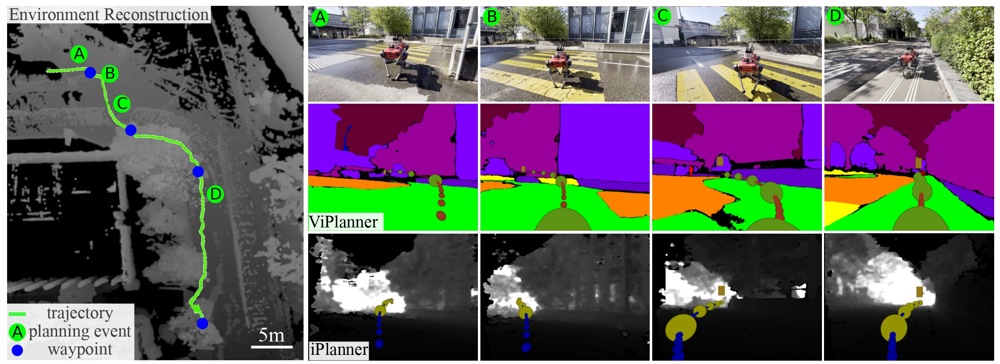

# ViPlanner: Visual Semantic Imperative Learning for Local Navigation

<p align="center">
  <a href="https://leggedrobotics.github.io/viplanner.github.io/">Project Page</a> •
  <a href="https://arxiv.org/abs/2310.00982">arXiv</a> •
  <a href="https://youtu.be/8KO4NoDw6CM">Video</a> •
  <a href="#citing-viplanner">BibTeX</a>

  Click on image for demo video!
  [](https://youtu.be/8KO4NoDw6CM)

</p>

ViPlanner is a robust learning-based local path planner based on semantic and depth images.
Fully trained in simulation, the planner can be applied in dynamic indoor as well outdoor environments.
We provide it as an extension for [NVIDIA Isaac-Sim](https://developer.nvidia.com/isaac-sim) within the [IsaacLab](https://isaac-sim.github.io/IsaacLab/) project (details [here](./omniverse/README.md)).
Furthermore, a ready to use [ROS Noetic](http://wiki.ros.org/noetic) package is available within this repo for direct integration on any robot (tested and developed on ANYmal C and D).

**Keywords:** Visual Navigation, Local Planning, Imperative Learning


## Install

- Install `pyproject.toml` with pip by running:
  ```bash
  pip install .
  ```
  or
  ```bash
  pip install -e .[standard]
  ```
  if you want to edit the code. To apply the planner in the ROS-Node, install it with the inference setting:
  ```bash
  pip install -e .[standard,inference]
  ```
  Make sure the CUDA toolkit is of the same version as used to compile torch. We assume 11.7. If you are using a different version, adjust the string for the mmcv install as given . If the toolkit is not found, set the `CUDA_HOME` environment variable, as follows:
  ```
  export CUDA_HOME=/usr/local/cuda
  ```
  On the Jetson, please use
  ```bash
  pip install -e .[inference,jetson]
  ```
  as `mmdet` requires torch.distributed which is only build until version 1.11 and not compatible with pypose. See the [Dockerfile](./Dockerfile) for a workaround.

**Known Issue**
- mmcv build wheel does not finish:
  - fix by installing with defined CUDA version, as detailed [here](https://mmcv.readthedocs.io/en/latest/get_started/installation.html#install-with-pip). For CUDA Version 11.7 and torch==2.0.x use
  ```
  pip install mmcv==2.0.0 -f https://download.openmmlab.com/mmcv/dist/cu117/torch2.0/index.html
  ```

**Extension**

This work includes the switch from semantic to direct RGB input for the training pipeline, to facilitate further research. For RGB input, an option exist to employ a backbone with mask2former pre-trained weights. For this option, include the github submodule, install the requirements included there and build the necessary cuda operators. These steps are not necessary for the published planner!

```bash
pip install git+https://github.com/facebookresearch/detectron2.git
git submodule update --init
pip install -r third_party/mask2former/requirements.txt
cd third_party/mask2former/mask2former/modeling/pixel_decoder/ops \
sh make.sh
```

**Remark**

Note that for an editable install for packages without setup.py, PEP660 has to be fulfilled. This requires the following versions (as described [here](https://stackoverflow.com/questions/69711606/how-to-install-a-package-using-pip-in-editable-mode-with-pyproject-toml) in detail)
- [pip >= 21.3](https://pip.pypa.io/en/stable/news/#v21-3)
	```
  python3 -m pip install --upgrade pip
  ```
- [setuptools >= 64.0.0](https://github.com/pypa/setuptools/blob/main/CHANGES.rst#v6400)
	```
  python3 -m pip install --upgrade setuptools
  ```


## Inference and Model Demo

1. Real-World <br>

	ROS-Node is provided to run the planner on the LeggedRobot ANYmal, for details please see [ROS-Node-README](ros/README.md).

2. NVIDIA Isaac-Sim <br>

	The planner can be executed within Nvidia Isaac Sim. It is implemented as part of the [IsaacLab Framework](https://isaac-sim.github.io/IsaacLab/) with an own extension. For details, please see [Omniverse Extension](./omniverse/README.md). This includes a **planner demo** in different environments with the trained model.


## Training

Here an overview of the steps involved in training the policy.
For more detailed instructions, please refer to [TRAINING.md](TRAINING.md).

0. Training Data Generation <br>
Training data is generated from the [Matterport 3D](https://github.com/niessner/Matterport), [Carla](https://carla.org/) and [NVIDIA Warehouse](https://docs.omniverse.nvidia.com/isaacsim/latest/tutorial_static_assets.html) using developed Isaac Sim Extension, the extensions are part of a new internal project (``isaac-nav-suite``) and will be open sourced with that project. In the case that you require an earlier access, please contact us via mail.

1. Build Cost-Map <br>
The first step in training the policy is to build a cost-map from the available depth and semantic data. A cost-map is a representation of the environment where each cell is assigned a cost value indicating its traversability. The cost-map guides the optimization, therefore, is required to be differentiable. Cost-maps are built using the [cost-builder](viplanner/cost_builder.py) with configs [here](viplanner/config/costmap_cfg.py), given a pointcloud of the environment with semantic information (either from simultion or real-world information).

2. Training <br>
Once the cost-map is constructed, the next step is to train the policy. The policy is a machine learning model that learns to make decisions based on the depth and semantic measurements. An example training script can be found [here](viplanner/train.py) with configs [here](viplanner/config/learning_cfg.py)

3. Evaluation <br>
Performance assessment can be performed on simulation and real-world data. The policy will be evaluated regarding multiple metrics such as distance to goal, average and maximum cost, path length. In order to let the policy be executed on anymal in simulation, please refer to [Omniverse Extension](./omniverse/README.md)


### Model Download
The latest model is available to download: [[checkpoint](https://drive.google.com/file/d/1PY7XBkyIGESjdh1cMSiJgwwaIT0WaxIc/view?usp=sharing)] [[config](https://drive.google.com/file/d/1r1yhNQAJnjpn9-xpAQWGaQedwma5zokr/view?usp=sharing)]

## <a name="CitingViPlanner"></a>Citing ViPlanner
```
@article{roth2023viplanner,
  title     ={ViPlanner: Visual Semantic Imperative Learning for Local Navigation},
  author    ={Pascal Roth and Julian Nubert and Fan Yang and Mayank Mittal and Marco Hutter},
  journal   = {2024 IEEE International Conference on Robotics and Automation (ICRA)},
  year      = {2023},
  month     = {May},
}
```

### License

This code belongs to Robotic Systems Lab, ETH Zurich.
All right reserved

**Authors: [Pascal Roth](https://github.com/pascal-roth), [Julian Nubert](https://juliannubert.com/), [Fan Yang](https://github.com/MichaelFYang), [Mayank Mittal](https://mayankm96.github.io/), [Ziqi Fan](https://github.com/fan-ziqi), and [Marco Hutter](https://rsl.ethz.ch/the-lab/people/person-detail.MTIxOTEx.TGlzdC8yNDQxLC0xNDI1MTk1NzM1.html)<br />
Maintainer: Pascal Roth, rothpa@ethz.ch**

The ViPlanner package has been tested under ROS Noetic on Ubuntu 20.04.
This is research code, expect that it changes often and any fitness for a particular purpose is disclaimed.
