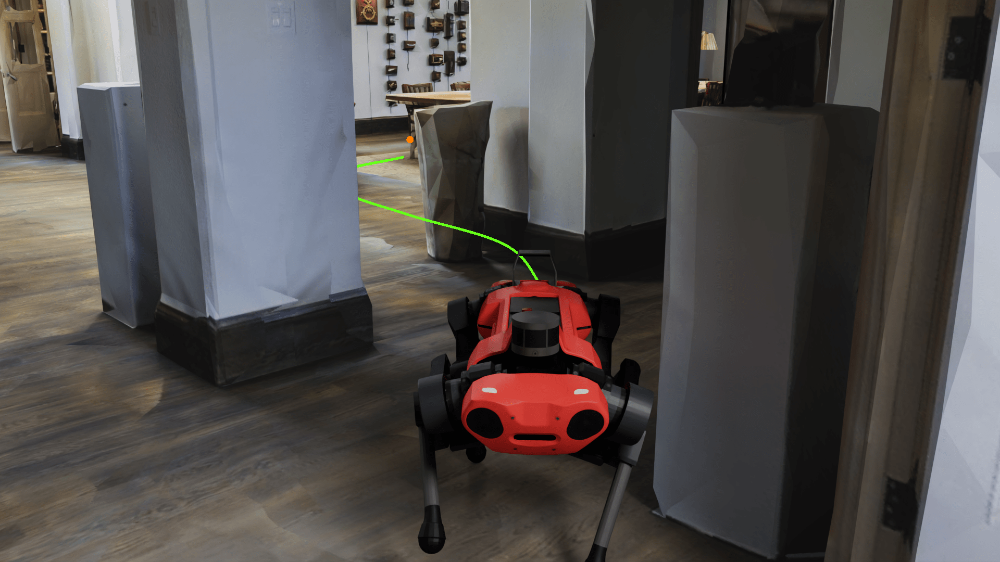
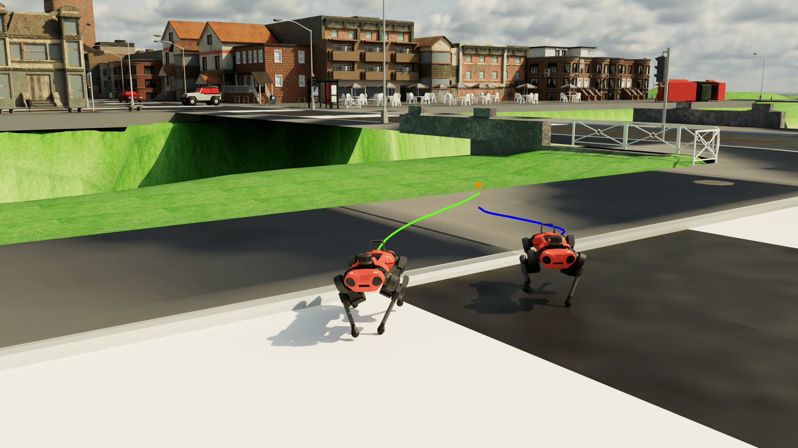

<div style="display: flex;">
    
    
</div>

# ViPlanner Omniverse Extension


[](https://docs.omniverse.nvidia.com/isaacsim/latest/overview.html)
[](https://docs.python.org/3/whatsnew/3.10.html)
[](https://releases.ubuntu.com/20.04/)
[](https://pre-commit.com/)
[](https://opensource.org/licenses/BSD-3-Clause)

The ViPlanner Omniverse Extension offers a testing environment for ViPlanner.
Within NVIDIA Isaac Sim as a photorealistic simulator and using [IsaacLab](https://isaac-sim.github.io/IsaacLab/), this extension provides an assessment tool for ViPlanner's performance across diverse environments.


## Installation

To install the ViPlanner extension for Isaac Sim version **4.2.0**, follow these steps:

1. Clone the [IsaacLab](https://github.com/isaac-sim/IsaacLab) repo.

    ```
    git clone git@github.com:isaac-sim/IsaacLab.git
    ```

    and follow the installation steps given [here](https://isaac-sim.github.io/IsaacLab/main/source/setup/installation)
    to install both IsaacLab and IsaacSim.

    **IMPORTANT**: The extension is tested with IsaacSim 4.2.0 and IsaacLab 1.2.0 (commit: 0bccd886c19a9891c0b6bdd37e13f338eacc0bba).
    While it may work with newer versions, it is not guaranteed. If you encounter issues, please switch back to the previous versions. Any
    PRs with updated versions are welcome.

3. Link the ViPlanner and Matterport extension to the IsaacLab repo.

    ```
    cd IsaacLab/source/extensions
    ln -s <path-to-viplanner-repo>/omniverse/extension/omni.viplanner .
    ln -s <path-to-viplanner-repo>/omniverse/extension/omni.isaac.matterport .
    ```

4. Install ViPlanner and the extension into the virtual environment of IsaacLab.

    ```
    cd IsaacLab
    ./isaaclab.sh -p -m pip install -e <path-to-viplanner-repo>  # this install the ViPlanner package
    ./isaaclab.sh -i  # this installs the additional extensions
    ```

**Remark**
It is necessary to comply with PEP660 for the install. This requires the following versions (as described [here](https://stackoverflow.com/questions/69711606/how-to-install-a-package-using-pip-in-editable-mode-with-pyproject-toml) in detail)
- [pip >= 21.3](https://pip.pypa.io/en/stable/news/#v21-3)
	```
  cd IsaacLab
  ./isaaclab.sh -p -m pip install --upgrade pip
  ```
- [setuptools >= 64.0.0](https://github.com/pypa/setuptools/blob/main/CHANGES.rst#v6400)
	```
  cd IsaacLab
  ./isaaclab.sh -p -m pip install --upgrade setuptools
  ```

## Usage

A demo script is provided to run the planner in three different environments: [Matterport](https://niessner.github.io/Matterport/), [Carla](https://carla.org//), and [NVIDIA Warehouse](https://docs.omniverse.nvidia.com/isaacsim/latest/features/environment_setup/assets/usd_assets_environments.html#warehouse).
In each scenario, the goal is represented as a movable cube within the environment.

To run the demo, download the model: [[checkpoint](https://drive.google.com/file/d/1PY7XBkyIGESjdh1cMSiJgwwaIT0WaxIc/view?usp=sharing)] [[config](https://drive.google.com/file/d/1r1yhNQAJnjpn9-xpAQWGaQedwma5zokr/view?usp=sharing)] and the environment files. Then adjust the paths (marked as `${USER_PATH_TO_USD}`) in the corresponding config files.

### Matterport
[Config](./extension/omni.viplanner/omni/viplanner/config/matterport_cfg.py)

To download Matterport datasets, please refer to the [Matterport3D](https://niessner.github.io/Matterport/) website. The dataset should be converted to USD format using Isaac Sim by executing the following steps:

1. Run the `convert_mesh.py` script to convert the `.obj` file (located under `matterport_mesh`) to `USD`. With the recent update of the asset converter script, use the resulting `*_non_metric.usd` file.

   ```
   # run the converter
   cd IsaacLab
   ./isaaclab.sh -p source/standalone/tools/convert_mesh.py matterport_mesh/xxx.obj matterport_mesh/xxx.usd --make-instanceable --collision-approximation convexDecomposition
   ```

   **IMPORTANT**

   - The conversion will fail if the asset name starts with a number (e.g., `0c334eaabb844eaaad049cbbb2e0a4f2.obj`), because the USD API prohibits this naming as explained [here](https://openusd.org/release/api/group__group__tf___string.html#gaa129b294af3f68d01477d430b70d40c8). This issue is described in more detail [here](https://forums.developer.nvidia.com/t/cant-create-prims-if-name-starts-with-number/249617).

   - Typically, the file should be converted with correct scale and rotation. In the case that you run the demo and the environment is rotated or scaled incorrectly, fix the import setting such as Rotation and Scale. (`Property -> Transform -> Rotate:unitsResolve = 0.0; Scale:unitsResolve = [1.0, 1.0, 1.0]`) and then save the USD.

2. Check that the converted mesh has colliders enabled. This can be done by starting IsaacSim (`./isaaclab.sh -s`), importing the converted usd mesh and visualizing the colliders (go to the "eye" symbol in the
top left corner, select `Show by Type -> Physics -> Colliders` and set the value to `All` ). The colliders should be visible as pink linkes. In the case that no colliders are presented, select the mesh in the stage,
go the `Property` section and click `Add -> Physics -> Colliders Preset`. Then save the asset.

The demo uses the **2n8kARJN3HM** scene from the Matterport dataset. A preview is available [here](https://aspis.cmpt.sfu.ca/scene-toolkit/scans/matterport3d/houses).

```
cd IsaacLab
./isaaclab.sh -p <path-to-viplanner-repo>/omniverse/standalone/viplanner_demo.py --scene matterport --model_dir <path-to-model-download-dir>
```

### Carla
[Download USD Link](https://drive.google.com/file/d/1wZVKf2W0bSmP1Wm2w1XgftzSBx0UR1RK/view?usp=sharing) | [Config](./extension/omni.viplanner/omni/viplanner/config/carla_cfg.py)

```
cd IsaacLab
./isaaclab.sh -p <path-to-viplanner-repo>/omniverse/standalone/viplanner_demo.py --scene carla --model_dir <path-to-model-download-dir>
```

### NVIDIA Warehouse
No need to adjust the config, as the asset is directly included in the repo.

```
cd IsaacLab
./isaaclab.sh -p <path-to-viplanner-repo>/omniverse/standalone/viplanner_demo.py --scene warehouse --model_dir <path-to-model-download-dir>
```

## Data Collection and Evaluation

The data collection is currently included in a new internal project and will be released with this project in the future.
If you require the code, please contact us per mail.
